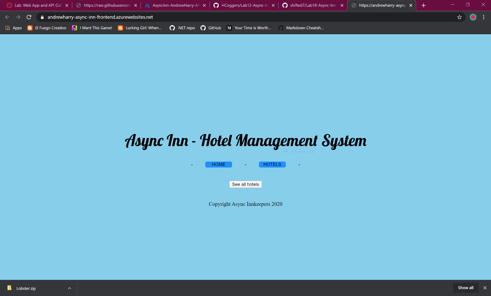
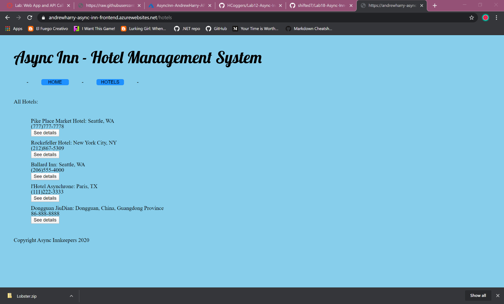
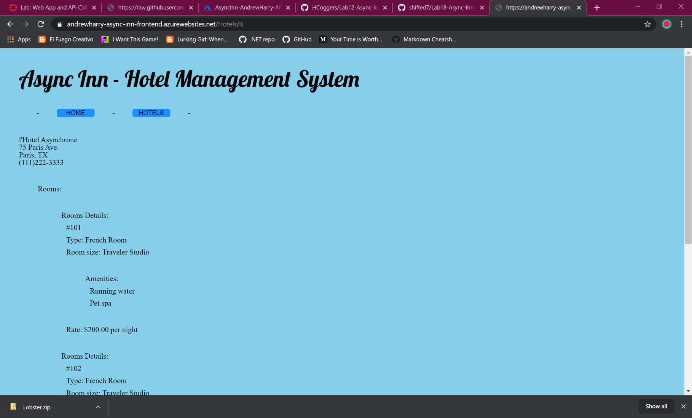

# Async Inn - Hotel Management System
#### Developed in collaboration by Andrew Casper and Harry Cogswell | *April 12th, 2020*
---
### [We're LIVE!](https://andrewharry-async-inn-frontend.azurewebsites.net/)
*https://andrewharry-async-inn-frontend.azurewebsites.net/*
---
## Web Application
***[Explain your app, should be at least a paragraph. What does it do? Why should I use? Sell your product!]***

This website makes request to our other project, a live api server at [this repository](github.com/HCoggers/Lab12-Async-Inn) developed in tandem to present a list of all Hotels, Rooms, and Amenities in the *Async Inn* database. Both projects have been deployed through Azure to deliver an easy to use catalog of all of Async Inn's locations.

When you first come to our site, just click the button and you can see a comprehensive list of all the active locations currently in our database. by selecting "see details" you can find out all about what rooms are available, and what complimentary amenities we provide.

The web application consists of a frontend written in Razor views, HTML, CSS and C#, using Newtonsoft JSON Framework for deserialization. The backend was written in C# using ASP.NET Core 3, Entity Framework Core, and the MVC framework.

---

## Tools Used
Microsoft Visual Studio Community 2019 (Version 16.4.5)

- C#
- ASP.Net Core
- Entity Framework
- NewtonSoft JSON
- MVC
- Azure

---

## Recent Updates

#### V 1.0
*Added CSS styling and Razor Layout* - 12 April 2020

---

## Demonstration
***[Provide some images of your app with brief description as title]***

>### Home Page
>

>### Hotels List
>

>### Details View
>

---

## Thanks for your Assistance!
Allyson Reyes  
Brody Rebne  
Jin Kim  
Rosalyn Johnson  
Sue Tarazi  

---

***Copyright Async InnKeepers 2020***
